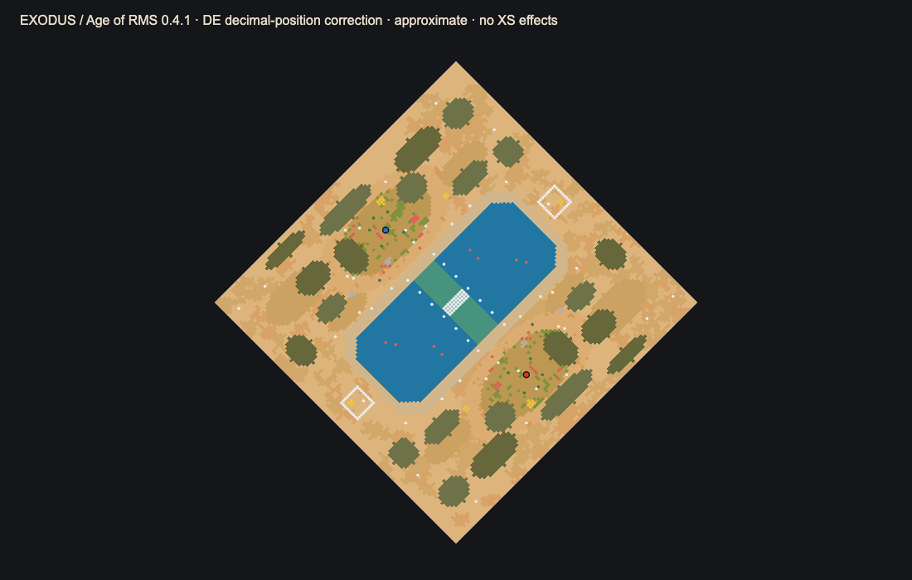

# Exodus: Sea of Signs

Diagnostic update: the direct-download XS prints `EXODUS XS BUILD: 2026-09-08 diag-01` on its first runtime tick. If initialization still fails, its final retry reports the first failed check with actual/expected dimensions, player count, landmark counts, or barrier coordinates/duplicate slot. Share that diagnostic message; event safety checks remain enabled. No ZIP was created for this update.

Direct-download hotfix (2026-09-08): `main` fixes the 1v1 initialization player count. Download the updated [exodus.xs](dist/Exodus/resources/_common/xs/exodus.xs) as a raw file. Existing v0.2.2 ZIPs do not contain this fix; no new ZIP was created. Native event validation remains pending.

**An epic biblical battlefield for AoE2 DE · Tiny · 1v1 · Conquest**

[Download the latest playtest ZIP](https://github.com/henrihallik/exodus-aoe2/releases/latest) · [Release history](https://github.com/henrihallik/exodus-aoe2/releases)

Two oasis settlements face a sea. Around it lie two coastal roads and the sealed ruins of an older kingdom. A bush catches fire without being consumed. Cloud becomes a pillar of flame. Food blossoms in the wilderness. The waters part—and later return. Seven trumpets bring down the walls.

The spectacle is public. The decisions are yours: take the long coastal road, commit to the temporary sea crossing, contest the gardens, or break into the ruins before the appointed hour.

Version **0.2.2 is an implemented playtest candidate, not an engine-validated competition submission**. It replaces the uninitialized global string rejected by DE in v0.2.1 with a numeric audio cue ID, and guards against uninitialized variables/global string state. The ASCII encoding correction and v0.2.0 presentation/audio upgrade are retained. Successful native compilation still needs confirmation. The source tests and external preview cannot certify native pathfinding, multiplayer synchronization, visual appearance, or custom audio playback.

The competitive-presentation upgrade adds 30- and 10-second flood reminders, priority-scheduled sounds, quiet positional shoreline/fire ambience, distinct opening and masonry cues, eased curtains, restrained transition mist, and recovery of missing decorative fires. Terrain, resources, damage, ordinary units and all event times are unchanged. See [0.2.0 changes](docs/UPGRADE-0.2.0.md).

An [AI-generated burning-bush art study](docs/ART.md) is separate from the playable map. **No custom sprite is bound or required yet**; current game graphics mappings and native testing are pending. The standard build keeps native scenery and uses no data mod.



Approximate initial layout only: Age of RMS does not execute XS. Its fractional-position rounding is corrected in our preview adapter, not in the map. See the [validation record](docs/VALIDATION.md) and [annotated planning atlas](docs/atlas.svg).

## What is implemented

| Sign | What happens |
| --- | --- |
| Burning bushes | Bringing a land unit within five tiles ignites either shrine once. The bush remains. No hidden combat or economy bonus. |
| Pillars of cloud and fire | Two mirrored guides move along the banks. Cloud by day; flame during the east wind and flood warning. |
| Manna | At 07:00 and 25:00, three 75-food forage bushes appear on each bank. Both gardens must successfully spawn or neither receives the wave. |
| Crossing of the sea | Wind at 11:00; animated withdrawal at 12:00; a ten-tile-wide sea road opens at **12:20**. |
| Returning flood | Public warning at **16:30**; waters return at **18:00**. Exposed land units on the marked seabed lose **6 HP per game second**, ignoring armor. Ships, garrisoned passengers, buildings and Gaia are exempt. |
| Seven trumpets / Jericho | Seven horn calls at 24:00–24:06. At 24:07 both original Gaia wall enclosures fall, exposing their existing gold and relics. Player walls are untouched. |

The sea repeats every 18 minutes: subsequent openings are 30:20, 48:20, and so on; subsequent floods are 36:00, 54:00, and so on. The two coastal routes **never close because of a scripted event**. Players can, of course, wall or contest them normally. All times are game time, not real-world time.

## Install

Extract `dist/Exodus-0.2.2.zip` (or the corresponding downloaded release ZIP). Replace both scripts from the same ZIP and start a new match; an already-running or saved match is not a reliable test of a changed script.

1. Place `Exodus.rms` in `resources\_common\random-map-scripts\`.
2. Place the required companion `exodus.xs` in `resources\_common\xs\`.
3. For the custom audio, place the twelve `.wem` files in `resources\_common\drs\sounds\`. The ZIP already has this directory structure. WAV files in `audio-source` are editable/listenable masters, **not** the files the game loads.
4. Use your DE player-profile resource folders or the corresponding game-installation folders. Install both scripts on both peers; do not rely on multiplayer transfer of the XS companion. Audio can also be installed as a local resource mod. See [audio notes](docs/AUDIO.md).
5. Select **Random Map → Custom → Exodus**, two players, **Tiny**, Dark Age, standard resources, standard dataset, Normal reveal, Conquest, 200 population. This is not a scenario file. Conquest is the supported contest format; other lobby formats and team games are not validated.
6. Confirm the opening `EXODUS: SEA OF SIGNS` message and the on-screen timer. An initialization/barrier failure message invalidates that generation for competition.

This map does not require a data mod or DLC-specific civilization. Native TC/villager/scout creation preserves the game's civilization-specific starts. No technologies, training options, resource stocks, gather rates, armor, movement speed, or maximum HP of normal player units are changed. The explicitly announced **flood hazard does remove current HP from exposed land units**; it can kill them. It is not harmless eye candy.

## Landscape and competitive structure

The map is a stylized biblical collage, not a literal reconstruction of one historical site or a chronological retelling. The palette combines warm desert, cracked ground, alluvial soil, green oasis floors, palm groves, acacia scrub, sandstone outcrops, small fires and blue-green water. Boar and deer belong to its greener fringes. There are no jungle tigers, snow forests, modern buildings, or borrowed game graphics in the package.

All authored terrain and Gaia object placements are paired by 180-degree rotation. Four relics avoid a central one-tile positional bias. Each player has eight sheep, two boar, four deer, six berry bushes, seven main gold tiles plus four expansion gold tiles, five main stone tiles plus four expansion stone tiles, and five straggler trees. Each Jericho enclosure holds four extra gold tiles and one relic. Eight paired sea fish allow a limited naval/fishing option, which needs balance testing. No free dock or fishing ship is supplied.

The underlying seabed is **permanently shallow, non-buildable terrain**. XS has no documented runtime terrain-repainting function. The sea is staged with native animated water graphics, Gaia scenery barriers, moving curtains, lighting transitions, and a bounded environmental-damage zone. It is not a fluid simulation or actual land-to-water terrain replacement. Sea barriers affect ships at their occupied tiles too; naval travel remains possible in the water basins around them.

Only Rock 2 scenery is repurposed as water barriers; fire, smoke and waterfall-background scenery are made nonblocking. Those changes target Gaia exclusively. The map creates no player-controlled supernatural hero or trainable custom unit.

## Files and reproducible build

The project is self-contained in `exodus-aoe2/`, separate from Deadfall.

```sh
python3 tools/audio.py
python3 tools/build.py
python3 -m unittest discover -s tests -v
node --test tests/events.test.cjs
```

The builder uses only Python's standard library. The event tests execute the actual XS source with mocked APIs; they are **not** a DE emulator. The authored atlas is generated from the same macro terrain/object data as the RMS and is labelled as a planning image.

- [Complete event contract](docs/EVENTS.md)
- [Audio production and compatibility](docs/AUDIO.md)
- [Validation record](docs/VALIDATION.md)
- [Engine playtest checklist](PLAYTEST.md)
- [Competition submission draft](SUBMISSION.md)
- [Third-party notices](THIRD_PARTY.md)

Technical references: [Forgotten Empires XS documentation](https://www.forgottenempires.net/age-of-empires-ii-definitive-edition/xs-scripting-in-age-of-empires-ii-definitive-edition), [UGC XS API reference](https://ugc.aoe2.rocks/general/xs/functions/functions/), [Zetnus's RMS guide](https://docs.google.com/document/d/1jnhZXoeL9mkRUJxcGlKnO98fIwFKStP_OBozpr0CHXo/edit), and [AoE2ScenarioParser datasets](https://github.com/KSneijders/AoE2ScenarioParser/tree/master/AoE2ScenarioParser/datasets).
